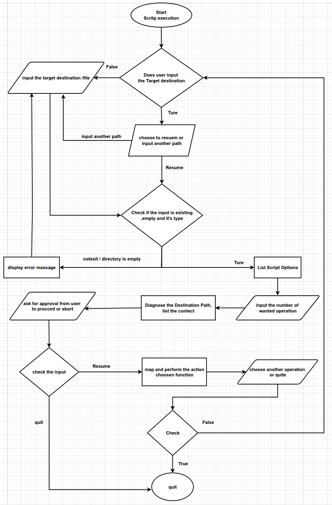

# The Compressing Lady Bug #

Script that's combines all archiving and compressing tools in Linux in one tool
the user runs the script with the target directory or will be asked to input a one
then he choose the service/action he wants
the script provides 3 main actions
- "Archive"
- "Compress"
- "Archive and Compress"

the work flow differ for each options, as some options has a direct following action, and another listed another options and tools

### Script Flowchart ###

